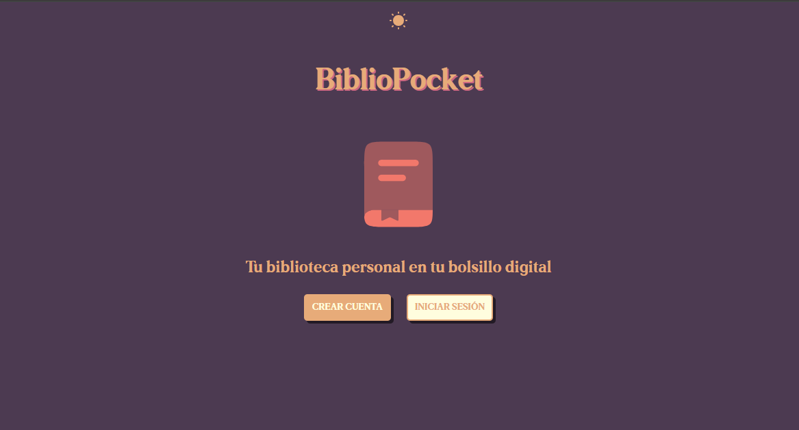

# BiblioPocket 📚
_Biblioteca virtual en la que la persona usuaria podrá buscar libros, guardarlos, modificar sus datos y categorizarlos. Creado con PHP, CSS y JS nativo (y haciendo uso de WebComponents)._

## ✍️ TO-DO:
<table>
  <tr>
    <th>Sección</th>
    <th>Caso de uso</th>
    <th>Operativo</th>
  </tr>
  <tr>
    <td>Landing</td>
    <td>La persona usuaria puede crear una cuenta e iniciar sesión</td>
    <td>✅</td>
  </tr>
  <tr>
    <td>Landing</td>
    <td>La persona usuaria, al crear una cuenta, recibirá un correo con el código de verificación que será requerido para darse de alta</td>
    <td>❌</td>
  </tr>
  <tr>
    <td>Inicio</td>
    <td>La persona usuaria puede visualizar sus últimos libros añadidos</td>
    <td>✅</td>
  </tr>
  <tr>
    <td>Mi estantería</td>
    <td>La persona usuaria puede buscar un libro a través de la API de <i>Google Books</i> y añadirlo a su estantería </td>
    <td>✅</td>
  </tr>
  <tr>
    <td>Mi estantería</td>
    <td>La persona usuaria puede crear un nuevo libro desde 0 y añadirlo a su estantería</td>
    <td>✅</td>
  </tr>
  <tr>
    <td>Mi estantería </td>
    <td>La persona usuaria puede consultar los libros añadidos a su estantería</td>
    <td>✅</td>
  </tr>
    <td>Mi estantería</td>
    <td>La persona usuaria puede modificar los datos de sus libros o eliminarlos de su estantería</td>
    <td>✅</td>
  </tr>
  <tr>
    <td>Mi estantería</td>
    <td>La persona usuaria puede consultar en base a determinados filtros los libros de su estantería</td>
    <td>❌</td>
  </tr>
  <tr>
    <td>Mi estantería</td>
    <td>La persona usuaria puede compartir una valoración (numérica [⭐] + reseña) de un libro leído</td>
    <td>❌</td>
  </tr>
  <tr>
    <td>Mi estantería</td>
    <td>La persona usuaria puede guardar anotaciones asociadas a cualquier libro de su estantería</td>
    <td>❌</td>
  </tr>
  <tr>
    <td>Mi perfil</td>
    <td>La persona usuaria puede modificar datos relativos a su cuenta personal y darse de baja</td>
    <td>✅</td>
  </tr>
  <tr>
    <td>Mi perfil</td>
    <td>La persona usuaria puede consultar estadísticas relativas a la actividad de su cuenta en <i>BiblioPocket</i></td>
    <td>✏️</td>
  </tr>
</table>